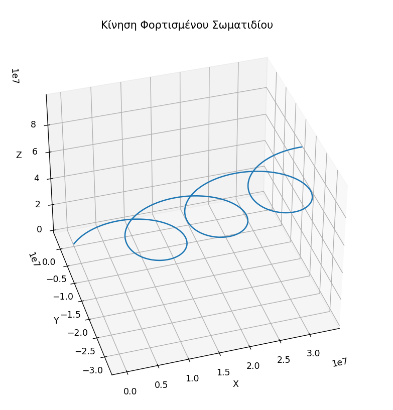

# Φυσική Πλάσματος
1. Ανάπτυξη κώδικα για την προσομοίωση κίνησης φορτισμένου σωματιδίου σε Ομογενές Μαγνητικό Πεδίο B(0,0,B_z) και Ηλεκτρικό πεδίο Ε(Ε_x,E_y,0) κάθετα μεταξύ τους .
2. Ο κωδικάς βρίκεται εδώ:
3.    

